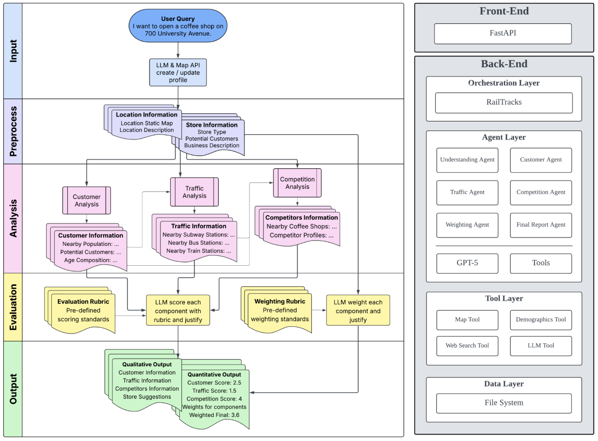

# SiteSage

> AI-powered retail site selection analysis for retail locations with explainable, data-driven insights.

**Powered by [Railtracks](https://github.com/RailtownAI/railtracks)** 

[](https://www.python.org/downloads/)
[](LICENSE)
[](https://github.com/RailtownAI/railtracks)



## Overview

SiteSage is an agentic site-selection system that evaluates retail locations using a staged analysis pipeline powered by LLMs and external data sources. It provides quantitative scores and qualitative insights for customer demographics, traffic accessibility, and competition analysis.

**Key Features:**

- 🤖 **7-stage AI agent pipeline** with sequential contextual analysis
- 🗺️ **Multi-region support**: Google Maps (US/Western) and AMap (China/Asia)
- 📊 **Data-driven insights**: Population demographics, transit access, competitor analysis
- 📝 **Explainable results**: Step-by-step markdown reports with evaluation rubrics
- 🎨 **Interactive UI**: Golden/royal themed web interface with live maps

## Quick Start

### Installation

1. **Clone the repository**

   ```bash
   git clone <repository-url>
   cd SiteSage
   ```

2. **Install dependencies**
  Suggested: 
  
  ```bash
  uv venv
  .venv\Scripts\activate
  uv pip install -e .
  ```

  or

   ```bash
   pip install -e .
   ```

3. **Configure environment**

   ```bash
   cp .env.sample .env
   # Edit .env and add your API keys
   ```

   Required API keys:

   - `OPENAI_API_KEY` - OpenAI API for LLM agents
   - `GOOGLE_MAPS_API_KEY` - Google Maps (for Western locations)
   - `AMAP_API_KEY` - AMap/高德 (for Chinese locations)

   See [docs/INSTALLATION.md](docs/INSTALLATION.md) for detailed setup instructions.

### Running the Application

```bash
cd src
python sitesage_frontend.py
```

Then open http://127.0.0.1:8000 in your browser.

### Example Usage

Enter a prompt like:

```
Open a boutique coffee shop targeting young professionals near Times Square, New York City.
```

Or in Chinese:

```
在南京东路300号附近开一家精品咖啡店，目标客户是年轻白领和学生。
```

The system will analyze:

- ✅ Customer demographics and population density
- ✅ Transit accessibility and parking availability
- ✅ Competitor landscape and market saturation
- ✅ Overall location suitability (0-10 score)

Results include interactive maps, detailed reports, and actionable recommendations.

## Architecture

SiteSage uses a **sequential agentic pipeline** where each stage builds on previous analyses:

```
Understanding → Customer → Traffic → Competition → Weighting → Evaluation → Final Report
     ↓            ↓          ↓           ↓             ↓            ↓            ↓
   Store Info  Pop Data   Transit    Competitors   Weights     Scores      Summary
```


Each agent uses:

- **LLM reasoning** (GPT-4) for analysis and synthesis
- **Specialized tools** for data retrieval (maps, demographics)
- **Rubric-based evaluation** for objective scoring

See [docs/DESIGN.md](docs/DESIGN.md) for detailed architecture documentation.

## Documentation

- 📘 [Installation Guide](docs/INSTALLATION.md) - Setup and configuration
- 📗 [API Reference](docs/API.md) - REST API documentation and examples
- 📙 [Design Document](docs/DESIGN.md) - Architecture and implementation details
- 📕 [AMap Setup](docs/AMAP_API.md) - Chinese location setup guide
- 🔧 [Troubleshooting](docs/TROUBLESHOOTING.md) - Common issues and solutions

## Project Structure

```
SiteSage/
├── src/
│   ├── sitesage_frontend.py      # FastAPI web server
│   ├── sitesage_backend.py       # Analysis pipeline
│   ├── tools/                    # Map and demographics tools
│   ├── prompts/                  # Agent system prompts
│   ├── rubrics/                  # Evaluation criteria
│   └── frontend/                 # Web UI (HTML/JS)
├── docs/                         # Documentation
├── tests/                        # Test suite
├── pyproject.toml               # Dependencies
└── .env.sample                  # Environment template
```

## Technology Stack

- **Backend**: Python 3.9+, FastAPI, uvicorn
- **AI/LLM**: OpenAI GPT-4, railtracks orchestration
- **Maps**: Google Maps Platform, AMap/高德地图
- **Demographics**: WorldPop rasters (global coverage)
- **Frontend**: HTML/CSS/JS, Leaflet maps, Marked markdown

## Sample Output

The system generates:

1. **Interactive map** with location marker
2. **Step-by-step reports** for each analysis stage
3. **Evaluation scores** (0-10 scale) with justifications
4. **Final executive summary** with recommendations

Example scores:

- Customer: 8.5/10 - Dense young professional population
- Traffic: 9.0/10 - Excellent transit access
- Competition: 6.5/10 - High competition but proven demand
- **Overall: 7.95/10** - Recommended with differentiation strategy

See [docs/sample_run/](docs/sample_run/) for complete example outputs.

## Development

```bash
# Install with dev dependencies
pip install -e ".[dev]"

# Run tests
pytest

# Type checking
pyright
```

## Limitations

- Prototype focused on coffee shops (extensible to other retail)
- Best results for urban/dense areas with good data coverage
- Requires API keys for full functionality
- LLM outputs may vary between runs

## Contributing

This is an academic project. For questions or issues, please open a GitHub issue.

## Acknowledgments

### Sponsored by Railtracks

This project is **proudly sponsored by [Railtracks](https://github.com/RailtownAI/railtracks)**, a powerful open-source agentic framework that makes building AI applications vibeable. The LLM facing in-code documentation saves me from the debugging nightmare of other framework, 100% recommend.

**Features Used in SiteSage:**

1. **Multi-Agent Orchestration**: all 7 specialized agents working in sequence with data flow and connections.
2. **Function Tools**: Custom tools for maps (Google Maps/AMap) and demographics (WorldPop)
3. **State Persistence**: All agent states saved for debugging and audit trails
4. **LLM Integration**: Seamless integration with all models, we use gpt, gemini and deepseek.
5. **Tool Call Iteration**: Agents can make multiple tool calls with parameter adjustments
6. **Error Recovery**: Graceful handling of API failures and partial results

**Learn More:**

- GitHub: [https://github.com/RailtownAI/railtracks](https://github.com/RailtownAI/railtracks)

---

### Other Credits

- **Coordinate Conversion**: [coordTransform](https://github.com/wandergis/coordTransform) - Helps conversion between WorldPop and standard coordinate systems
- **Search**: DuckDuckGo Search (ddgs)

## License

MIT. However, please comply with API provider terms of service, in particular for the asia region which use a range of different API and service providers.

---

**Built with ☕ from Railtracks**
